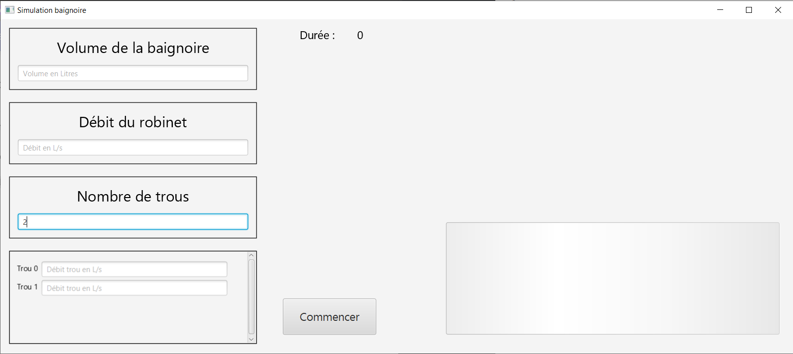

# Documentation fonctionnelle

Ce programme permet de simuler le remplissage d'une baignoire grâce à un robinet, sachant qu'elle est percée de plusieurs trous. 

Il est donc demandé à l'utilisateur de remplir les différentes zones de texte pour définir les paramètres suivants :

## Paramètres

#### Le volume de la baignoire

Défini le volume maximum que peut contenir la baignoire. Une fois ce volume atteint (s'il est atteint un jour), le programme s'arrête.

#### Le débit du robinet

Défini la vitesse d'écoulement du robinet dans la baignoire. Une valeur plus élévée permet de la remplir plus rapidement.

#### Nombre de trous

Défini le nombre de trous dont la baignoire est percée. **Attention :** il est nécéssaire de presser la touche `Entrée` un fois la valeur entrée afin d'afficher la zone de texte de chaque trou.

#### Débit de chaque trou

Le débit d'un trou défini la vitesse à laquelle la baignoire va perdre de l'eau par le trou. La vitesse totale d'écoulement sera alors la somme de tous les trous. *Exemple :* un trou de débit 0.5L/s et un second de débit 0.2L/s donnera un écoulement total de 0.7L/s.

## Lancement

Une fois les valeurs rentrées, appuyer sur le bouton "Commencer" afin de lancer la simulation. On peut alors observer la baignoire se remplir si le débit du robinet est supérieur au débit total d'écoulement des trous.

La simulation s'arrêtera alors seulement lorsque la baignoire sera pleine ou si l'écoulement du robinet est inférieur à celui des trous (et donc qu'elle restera indéfiniement vide).

